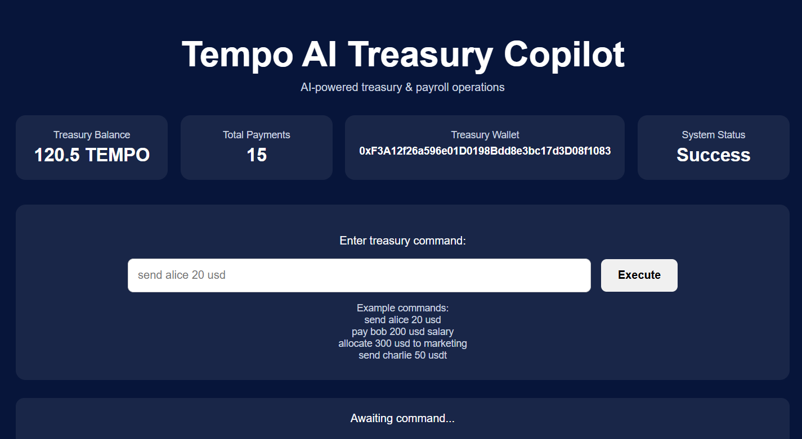

# Tempo AI Treasury Copilot

AI-powered treasury & payroll operations for on-chain teams.

Tempo AI Treasury Copilot converts natural language commands into treasury transactions.

Example:

send alice 20 usd  
pay bob 200 usd salary  
allocate 300 usd to marketing  

---

# Demo

Live dashboard

http://46.62.230.195:3000/dashboard.html

Example command

send alice 20 usd

---

# Architecture

User
 ↓
Dashboard UI
 ↓
AI Command Interpreter
 ↓
Treasury Engine
 ↓
Transaction Generator
 ↓
Blockchain / Treasury Wallet

---

# How it Works

1. User enters a natural language treasury command.
2. The AI interpreter extracts intent, recipient, amount and currency.
3. The treasury engine prepares the transaction.
4. The system generates a blockchain transaction.

---

# Example Commands

send alice 20 usd  
pay bob 200 usd salary  
allocate 300 usd to marketing  
send charlie 50 usdt  

---

# Use Cases

DAO payroll  
Contributor payments  
Treasury management  
Operational fund allocation  

---

# Why This Matters

Treasury operations in crypto teams are still manual and error-prone.

Tempo AI Treasury Copilot introduces a natural language interface that simplifies treasury management and makes financial operations accessible to both technical and non-technical team members.

---

# Tech Stack

Node.js  
Ethers.js  
Express.js  
AI command interpreter logic  
On-chain treasury execution model  

---

# Author

Kriptoboss

---

# Tagline

**Execute treasury operations with natural language.**

Tempo AI Treasury Copilot turns simple commands like:

send alice 20 usd

into structured treasury transactions for on-chain teams.

---

# Problem

Treasury operations in crypto teams are still manual, technical, and error-prone.

Teams must manage wallet addresses, transfers, contributor payments, and operational funding manually.

---

# Solution

Tempo AI Treasury Copilot introduces a natural language interface for treasury management.

Users can execute treasury operations by simply typing commands like:

send alice 20 usd  
pay bob 200 usd salary  
allocate 300 usd to marketing

The system interprets intent and converts commands into treasury transactions.

---

# Impact

This approach simplifies treasury operations and makes financial workflows accessible to both technical and non-technical team members.

It reduces operational complexity and introduces a more intuitive interaction model for on-chain treasury management.

---

# Dashboard Preview

---

# Vision

Tempo AI Treasury Copilot aims to become a programmable financial interface for on-chain teams.

Instead of interacting directly with wallets and complex financial tools, teams will be able to manage treasury operations using simple natural language commands.

Our long-term vision is to enable AI-driven financial operations where treasury workflows can be automated, audited, and executed through intelligent interfaces.

---

# Future Roadmap

- Multi-wallet treasury support
- Automated payroll for DAO contributors
- AI-driven treasury recommendations
- Transaction approval workflows
- Integration with stablecoin payment rails
- Smart treasury policies and automation

